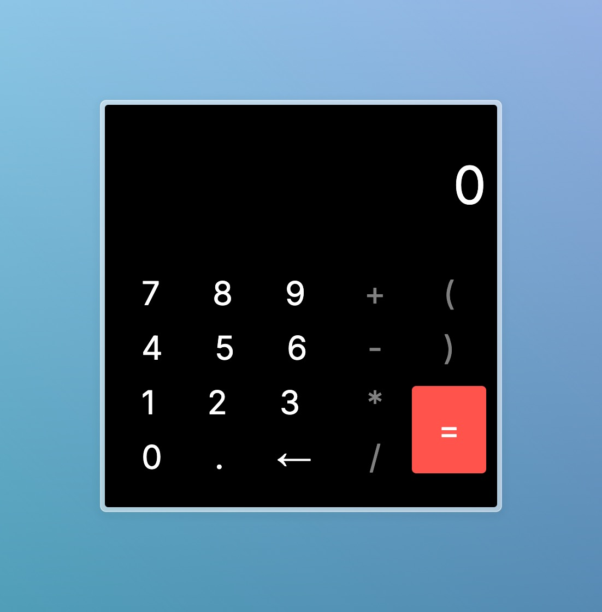

# Calculator



This is a calculator application built with Next.js, Tauri, and Tailwind CSS. It provides a desktop application experience using Tauri while leveraging the power of React and Next.js for the frontend.

## Table of Contents

- [Technologies](#technologies)
- [Installation](#installation)
- [Scripts](#scripts)
- [Dependencies](#dependencies)
- [License](#license)

## Technologies

<div>
    <a href="https://react.dev/" target="_blank">
        
    </a>
    <a  href="https://nextjs.org/" target="_blank">
        
    </a>
    <a href="https://tailwindcss.com/" target="_blank">
        
    </a>
     <a href="https://tauri.app/" target="_blank">
        
    </a>
     <a href="https://tauri.app/" target="_blank">
       
    </a>

</div>

## Installation

1. **Clone the repository:**

   ```bash
   git clone https://github.com/keevenoliveira/calculator.git
   cd calculator
   ```

2. **Install dependencies:**

   ```bash
   yarn install
   ```

3. **Install Rust**

   ```bash
   curl --proto '=https' --tlsv1.2 -sSf https://sh.rustup. rs | sh
   ```

   or consider the official Website of Rust Language, [here](https://www.rust-lang.org/tools/install).

## Scripts

- Start Development Server (if you need run just ):

  ```bash
  yarn dev
  ```

- Start desktop Server:

  ```bash
  yarn desktop
  ```

- Run tests:

  ```bash
  yarn test
  ```

- Watch Tests:

  ```bash
  yarn test:watch
  ```

- Lint Code:

  ```bash
  yarn lint
  ```

## Dependencies

- **@tauri-apps/api**: Tauri API for desktop integration
- **next**: React framework for server-side rendering
- **react & react-dom:**: Core React libraries
- **react-toastify**: Notifications
- **styled-components**: CSS-in-JS library

## License

This project is licensed under the MIT License. See the LICENSE file for details.
